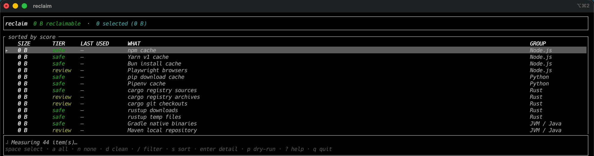
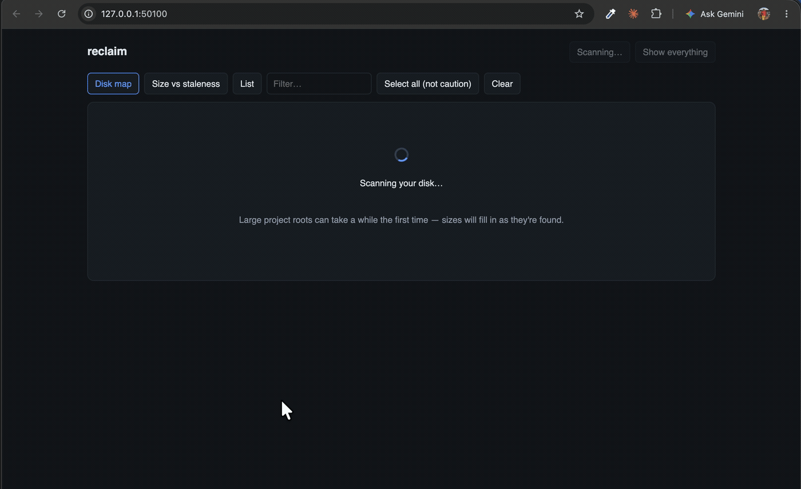

# reclaim

Find and safely reclaim the disk space your toolchains leave behind.

`reclaim` scans the caches and build artifacts left by Node, Python, Rust, JVM,
Go, Xcode, Android, Docker, .NET, Ruby, PHP, Dart and friends — then tells you,
for each one, **how stale it is**, **what it will cost you to get it back**, and
**what could go wrong** if you delete it. It removes only what you choose.

It also finds local AI tooling — Ollama, LM Studio, ComfyUI, SillyTavern and
Automatic1111 model/output directories — and flags when a tool looks like it's
currently running so you don't pull a model out from under a live server. This
group is large and opt-in: see [docs/providers.md](docs/providers.md#others).



`reclaim scan` prints the same thing without the interactive UI (excerpt from a
real run):

```
Node.js  (5.85 GB)
    2.10 GB  review     2 weeks ago     Playwright browsers
      ~/Library/Caches/ms-playwright  → re-download from Playwright CDN
      ! Re-downloaded automatically, but it is a large download on a slow link.

Go  (1.99 GB)
    1.99 GB  review     today           Go module cache
      ~/go/pkg/mod  → re-download from the Go module proxy
      ! Go marks these files read-only, so this is cleaned with `go clean -modcache`
        rather than a plain delete.

Editors & IDEs  (1.03 GB)
     439 MB  review     13 days ago     Code workspace storage
      ~/Library/Application Support/Code/User/workspaceStorage  → gone forever
      ! Loses per-project editor state such as open tabs and local history.

Total reclaimable: 10.0 GB
scanned 0 project(s) in 10.6s
```

## Why not `du -sh` and `rm -rf`

`du` tells you a directory is 12 GB. It does not tell you that you last touched it
in March, that deleting the pnpm store breaks every `node_modules` on the machine,
or that half of `~/.m2` was built locally and exists nowhere else. Those are the
facts that decide whether you should delete something, and they are what `reclaim`
is built to surface.

It is also fast, because sizing is a parallel walk rather than a serial one: a
full scan of the home directory above — 44 candidates, 10 GB of results — takes
**about 11 seconds**.

## Install

**Homebrew** (macOS or Linux, Intel or ARM):

```sh
brew install gokul-kulkarni/tap/reclaim
```

**Without Homebrew** — the same prebuilt binaries via a plain install script:

```sh
curl -fsSL https://github.com/gokul-kulkarni/reclaim/releases/latest/download/install.sh | sh
```

Both fetch a prebuilt binary; neither needs Rust or Node installed. To upgrade
later: `brew upgrade reclaim`, or re-run the `curl` line.

**From source** (for development, or if you'd rather build it yourself):

```sh
git clone https://github.com/gokul-kulkarni/reclaim && cd reclaim
npm --prefix web ci && npm --prefix web run build   # embeds the web UI
cargo install --path crates/reclaim-cli
```

`cargo install reclaim-cli` also works, but ships the "frontend not built"
fallback page for `reclaim ui` unless `web/dist` is vendored — the CLI and TUI
are unaffected. See [docs/releasing.md](docs/releasing.md) for how releases and
the tap are built.

Then:

```sh
reclaim
```

## Use

```sh
reclaim                                 # interactive terminal UI
reclaim scan                            # plain report, deletes nothing
reclaim scan --json                      # machine-readable
reclaim clean --tier safe --yes          # remove regenerable caches
reclaim clean --older-than 90d --dry-run # only long-untouched things, report only
reclaim ui                               # rich web UI on localhost
reclaim history                          # what previous runs did
reclaim history report --open            # detailed HTML report: trends, by ecosystem, failures
reclaim schedule install --cadence weekly
```

### The terminal UI

Grouped by ecosystem, sizes filling in live as they are measured.
`space` selects, `a` selects everything safe, `enter` shows the full evidence for
an item, `d` reclaims, `p` toggles dry-run, `?` for keys.

### The web UI



`reclaim ui` opens a page with a treemap of your disk, a size-against-staleness
plot whose top-right quadrant is the easy wins, and the same list with a detail
drawer. It binds `127.0.0.1` only, requires a token minted per process, rejects
cross-site origins, and dies with the command. It can select and delete, exactly
like the terminal UI. A History tab tracks lifetime totals, a trend over every
run, a breakdown by ecosystem and trigger, and any failures worth investigating.

## How it decides

Every candidate carries a **risk tier**:

| Tier | Meaning | Examples |
|---|---|---|
| `safe` | Regenerates automatically on the next build. | `~/.npm`, `DerivedData`, `.gradle/caches` |
| `review` | Recoverable, but costs a re-download or a long rebuild. | `~/.m2`, simulator runtimes, NDK versions |
| `caution` | May be irreplaceable. Never removed without explicit confirmation. | Xcode Archives, docker volumes, AVDs |

…plus **how it comes back** (`auto on next npm install` / `1.2 GB re-download` /
`~8 min rebuild` / `gone forever`), **when you last used it**, and any
**warnings** the provider attached. The tool ranks items by a reclaim score, but
the score is only a sorting aid — the argument for deleting something is the
evidence, which is always shown.

**Staleness comes from the project, not the artifact.** A `target/` directory
whose own mtime is six months old still belongs to a repository you committed to
yesterday, and that project is not stale. Artifact candidates derive their age
from the owning project's source files and git activity, which is why an actively
developed project's build output ranks near the bottom of the list even when it
is the largest single item on disk.

## Safety

- Every path is re-validated immediately before removal, not just at scan time —
  a symlink can be swapped in while you deliberate.
- Refuses `$HOME` itself, `/`, system directories, `~/.ssh`, `~/Documents`,
  anything containing a `.git` component, anything outside the allowed roots, and
  anything you add to `delete.protected_paths`. There is no `--force` past this.
- Default delete mode is **tiered**: `safe` items are purged so the space is
  actually freed; anything riskier goes to the Trash so it is recoverable.
  `--trash` / `--purge` override per run.
- Trashed bytes are reported separately from freed bytes, because a tool that
  says "freed 40 GB" while your disk is unchanged is lying to you.
- `clean` is a dry run unless you pass `--yes` or answer a prompt.
- Every run — including scheduled ones — is journalled to
  `~/.local/state/reclaim/history/`. See it with `reclaim history`.

## Sizes

Sizes are computed from `st_blocks`, so sparse files and APFS clones report what
you would actually get back rather than their apparent size. Hardlinked content —
the pnpm store, conda's `pkgs`, Nix — is counted **once** across the whole scan,
with the duplicate bytes reported separately as `shared`. Totals therefore match
reality rather than the sum of `du` over each directory.

> One caveat: when several candidates share the same inodes, the per-row split of
> unique versus shared bytes depends on measurement order. The **total** is always
> correct, and each row shows its shared amount, but do not read a single row's
> figure as "exactly what deleting this alone frees".

## Background cleanup

```sh
reclaim schedule install --cadence weekly    # launchd on macOS, systemd user timer on Linux
reclaim schedule status
reclaim schedule uninstall
```

Background runs are constrained: they never touch the `caution` tier, they run at
low IO priority so they cannot fight a build, and the first run is a dry run you
can inspect with `reclaim history` before arming it.

## Configure

```sh
reclaim config init      # writes a fully commented ~/.config/reclaim/config.toml
reclaim config show      # effective config
reclaim config validate
```

The setting most worth changing is `scan.project_roots` — point it at where you
keep code and `reclaim` will find `node_modules`, `target/`, `.venv` and friends:

```toml
[scan]
project_roots = ["~/dev", "~/work"]
```

See [docs/config.md](docs/config.md) for every option and
[docs/providers.md](docs/providers.md) for exactly what each provider touches.

## Development

```sh
cargo test --workspace
npm --prefix web ci && npm --prefix web run build   # required before a release build
cargo build --release
cargo run -- --root /tmp/sandbox scan               # operate on a sandbox home
```

`--root` reparents the entire engine, which is how the tests exercise real
filesystem behaviour without touching your actual home directory. It also
suppresses the providers that reclaim by running a command (`brew cleanup`,
`docker prune`, `simctl delete`), since those act on machine-global state that a
sandbox cannot represent.

### Packaging

```sh
./scripts/package.sh      # build dist/reclaim-<target>.tar.gz + .sha256, as CI does
./scripts/brew-test.sh    # install that tarball through Homebrew for real, then test and audit it
```

`brew-test.sh` builds a tarball from your working tree, points a throwaway local
tap at it with a real checksum, runs `brew install`, `brew test` and
`brew audit --strict`, then uninstalls. It exercises the exact path a user takes
on `brew install`, minus the download — so a broken formula is caught before
anything is published. See [docs/releasing.md](docs/releasing.md).

## Platforms

macOS and Linux are supported and tested. Windows compiles; providers with no
Windows equivalent simply find nothing.

## Changes

See [CHANGELOG.md](CHANGELOG.md) for what changed in each release.

## Licence

MIT
